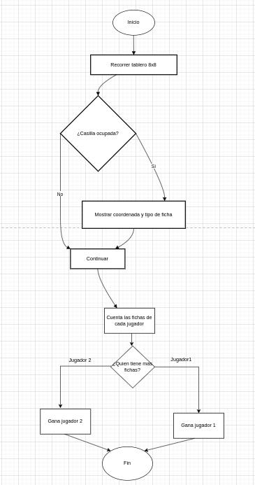

# Examen 1ª Evaluación

/**
* Un ordinograma que me recorre un tablero de 8x8 de damas  sacando por pantalla si la casilla está ocupada (mostrando la coordenada) y que tipo de ficha es.
* @author Adrian Hermo
* @version 1.0
*/

---

Las funciones que usaria serian un if, else y un bucle 

Explica a continación cada apartado del examen

Con cada apartado realiza un commit diferente